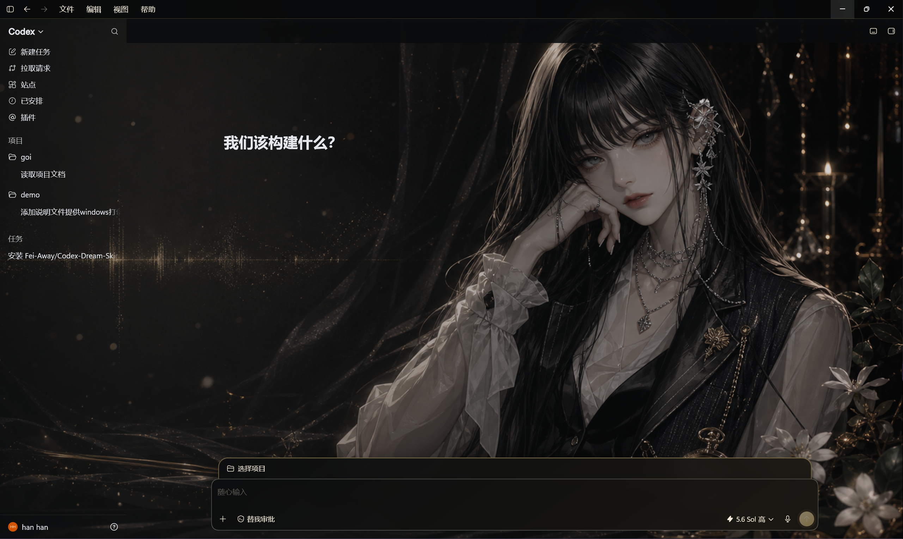
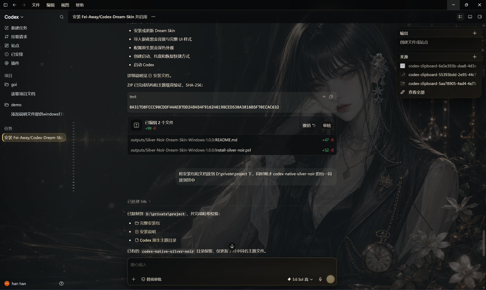
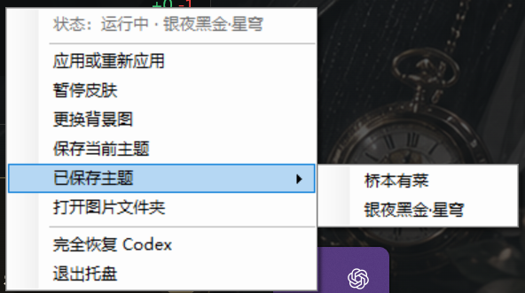

# Silver Noir for Codex Desktop

**银夜黑金主题系列：夜冕 / 幽绫 / 月蚀**

一套面向 Codex Windows 桌面版的深色黑金主题系列。你可以只导入 Codex 原生外观，也可以从三种人物背景风格中选择完整 Dream Skin 安装包，获得背景图、半透明面板、按钮、输入框和弹窗等完整效果。

> [!IMPORTANT]
> 本项目不是 OpenAI 官方项目。安装前请先阅读“备份与恢复”。如果 Codex 正在运行，安装器会在关闭并重新启动它之前请求确认。



## 效果预览

| 新建任务首页 | 任务页面 |
| --- | --- |
|  |  |

### 背景风格

| 银夜黑金·夜冕 | 银夜黑金·幽绫 | 银夜黑金·月蚀 |
| --- | --- | --- |
|  |  |  |

Dream Skin 托盘菜单中会显示已保存的主题：



## 选择使用方式

| 方式 | 会修改什么 | 背景图与完整 UI | 是否需要 Dream Skin 运行 | 适合人群 |
| --- | --- | --- | --- | --- |
| **A. 导入 Codex 原生外观** | 当前“深色”外观槽位的颜色、字体、对比度与代码主题 | 不包含 | 导入后不需要 | 只想改变原生配色，追求稳定、轻量 |
| **B. 安装完整 Dream Skin** | Dream Skin 运行时、银夜黑金主题、背景图及扩展 CSS | 包含 | 每次使用完整效果时需要 | 想获得截图中的完整黑金效果 |

两种方式互不强制。你可以只执行方式 A，也可以直接使用方式 B。

## 方式 A：导入并覆盖 Codex 原生深色外观

这种方式使用 Codex 自带的“外观导入”功能，不安装 Dream Skin，也不会修改 Codex 程序文件。

### 导入前先备份

导入会**覆盖当前 Codex 的深色外观槽位**。如果你正在使用自定义深色主题，请先在 Codex 的“设置 → 外观”中复制导出当前主题，并将导出文本保存到安全位置。

> [!WARNING]
> 切换到浅色模式并不等于恢复。它只会暂时使用另一个外观槽位，原来的深色主题仍已被导入内容替换。

### 直接复制原生主题

点击下面代码块右上角的复制按钮，即可复制完整的 Codex 原生主题文本：

```text
codex-theme-v1:{"codeThemeId":"codex","theme":{"accent":"#D8BA72","contrast":68,"fonts":{"code":"Cascadia Code","ui":"Microsoft YaHei UI"},"ink":"#F2EAD9","opaqueWindows":false,"semanticColors":{"diffAdded":"#40C977","diffRemoved":"#FA423E","skill":"#D8BA72"},"surface":"#0B0D0E"},"variant":"dark"}
```

三款安装包均包含相同的原生主题文件，可从[夜冕版](./codex-silver-noir-night-crown-windows-1.0.0/native-theme/silver-noir-dark.codex-theme.txt)、[幽绫版](./codex-silver-noir-shadow-silk-windows-1.0.0/native-theme/silver-noir-dark.codex-theme.txt)或[月蚀版](./codex-silver-noir-lunar-eclipse-windows-1.0.0/native-theme/silver-noir-dark.codex-theme.txt)打开或下载。

### 导入步骤

1. 打开 Codex 的“设置 → 外观”。
2. 将外观模式切换为“深色”，确保正在编辑深色外观。
3. 复制上方代码块中的完整 `codex-theme-v1:` 文本。
4. 在 Codex 外观设置中选择“导入”，粘贴文本并确认。
5. 如果 Codex 提示主题变体不匹配，请确认当前外观模式确实为“深色”，然后重新导入。

导入只覆盖深色外观槽位，不会修改浅色外观槽位。

### 恢复原生外观

根据你的备份情况选择一种恢复方法：

#### 恢复导入前的自定义主题（推荐）

在“设置 → 外观”中切换到“深色”，重新导入你在操作前导出的主题文本。这是恢复到原有自定义外观的唯一准确方式。

#### 恢复 Codex 默认深色主题

点击下面代码块右上角的复制按钮，复制完整的 Codex 默认深色主题文本：

```text
codex-theme-v1:{"codeThemeId":"codex","theme":{"accent":"#339CFF","contrast":60,"fonts":{"code":null,"ui":null},"ink":"#FFFFFF","opaqueWindows":false,"semanticColors":{"diffAdded":"#40C977","diffRemoved":"#FA423E","skill":"#AD7BF9"},"surface":"#181818"},"variant":"dark"}
```

三款安装包均包含相同的默认恢复文件，可从[夜冕版](./codex-silver-noir-night-crown-windows-1.0.0/native-theme/codex-default-dark-backup.codex-theme.txt)、[幽绫版](./codex-silver-noir-shadow-silk-windows-1.0.0/native-theme/codex-default-dark-backup.codex-theme.txt)或[月蚀版](./codex-silver-noir-lunar-eclipse-windows-1.0.0/native-theme/codex-default-dark-backup.codex-theme.txt)打开或下载。复制完整文本后，在 Codex 的深色外观中导入。

> [!NOTE]
> 随包提供的默认备份用于恢复打包时 Codex 版本的默认深色外观，不能还原你此前自行定制的主题。Codex 后续版本若更改默认配色，建议优先使用你自己导出的备份。

## 方式 B：安装完整 Dream Skin 版本

完整版本包含背景图、黑金按钮、输入框、弹窗、顶部导航、半透明面板和布局微调等效果。

### 选择安装包

| 主题 | 风格 | 安装包 |
| --- | --- | --- |
| **银夜黑金·夜冕** | 黑金流光与怀表，幽暗奢华、高贵典雅 | [`codex-silver-noir-night-crown-windows-1.0.0.zip`](./codex-silver-noir-night-crown-windows-1.0.0.zip) |
| **银夜黑金·幽绫** | 全黑披肩礼服，幽深柔美、含蓄魅惑 | [`codex-silver-noir-shadow-silk-windows-1.0.0.zip`](./codex-silver-noir-shadow-silk-windows-1.0.0.zip) |
| **银夜黑金·月蚀** | 黑白衣着交叠，明暗相蚀、沉静优雅 | [`codex-silver-noir-lunar-eclipse-windows-1.0.0.zip`](./codex-silver-noir-lunar-eclipse-windows-1.0.0.zip) |

三个安装包使用不同主题 ID，可以同时安装并在 Dream Skin 的“已保存主题”中切换。

### 环境要求

- Windows 10 或 Windows 11
- Codex Windows 桌面版
- PowerShell 5.1 或更高版本
- 可用的 Node.js 运行环境（安装器会自动检查）

### 安装步骤

1. 从上表下载所需安装包并完整解压。不要直接在压缩包预览窗口中运行脚本。
2. 在所选安装包的解压目录中打开 PowerShell。
3. 运行：

```powershell
powershell.exe -NoProfile -ExecutionPolicy Bypass -File .\install-silver-noir.ps1 -StartNow
```

安装器可以安全地重复运行。已有 Dream Skin 托盘会在更新运行时前自动停止，并在安装完成后重新启动；无需手动退出托盘。如果 Codex 正在运行，安装器会请求确认，随后关闭 Codex、更新 Dream Skin、选择该安装包对应的主题，再自动以 Dream Skin 重新打开 Codex。取消确认不会修改配置。

只安装、不立即启动：

```powershell
powershell.exe -NoProfile -ExecutionPolicy Bypass -File .\install-silver-noir.ps1
```

如果执行这条命令时 Codex 原本处于关闭状态，安装完成后仍保持关闭；如果 Codex 原本正在运行，则更新完成后会自动重新打开，以恢复安装前的运行状态。

不创建桌面快捷方式：

```powershell
powershell.exe -NoProfile -ExecutionPolicy Bypass -File .\install-silver-noir.ps1 -NoShortcuts -StartNow
```

### 两个快捷方式的作用

- `Codex Dream Skin`：日常启动入口。它负责启动或重启官方 Codex、建立并验证本地 CDP 调试会话、启动皮肤注入进程，并自动确保任务栏通知区域中的托盘控制正在运行。完整背景、半透明面板和布局效果需要从这个入口启动。
- `Codex Dream Skin - Restore`：独立恢复入口。它会停止托盘与注入进程、结束 Dream Skin 使用的本地调试会话、恢复安装前记录的 Codex 外观相关配置，并重新打开普通 Codex。

### 启动与样式保留

- 原生外观中的颜色、字体和代码主题保存于 Codex 配置中，Dream Skin 退出后仍会保留。
- 背景图、半透明面板、按钮、弹窗和布局微调由 Dream Skin 在运行时注入。正常退出后，这些扩展效果不会永久写入 Codex 程序；下次需要通过 `Codex Dream Skin` 快捷方式启动。
- Dream Skin 不直接修改 Microsoft Store 的 Codex 安装目录或 `app.asar`。

### 完整恢复 Codex

关闭 Codex 后，可用以下任一方式移除 Dream Skin 的扩展效果：

- 双击桌面的 `Codex Dream Skin - Restore` 快捷方式；或
- 右键 Dream Skin 托盘图标，选择“完全恢复 Codex”。

恢复操作会移除 Dream Skin 注入并恢复由 Dream Skin 管理的配置。已保存主题通常会保留在 `%LOCALAPPDATA%\CodexDreamSkin\themes`，便于以后再次使用。

如果你还手动执行过“方式 A”的原生主题导入，请再导入自己的备份，或导入任一安装包 `native-theme` 目录中的 `codex-default-dark-backup.codex-theme.txt`。“完全恢复 Codex”不会替你猜测并覆盖手动导入的原生主题。

## 原生主题与完整皮肤的区别

Codex 原生导入格式能够保存颜色、对比度、界面字体、代码字体和代码主题，但不包含以下内容：

- 背景图片及其定位、缩放和遮罩
- 首页、任务页的布局与宽度微调
- 按钮、输入框、菜单和弹窗的细节样式
- 玻璃质感、半透明面板与扩展阴影

这些效果由 Dream Skin 的 CSS 和运行时提供。因此，如果导入后只有颜色变化而没有背景图，这是正常现象。

## 仓库结构

```text
codex-silver-noir-theme/
├─ README.md
├─ images/
│  ├─ silver-noir-night-crown.png             # 夜冕背景
│  ├─ silver-noir-shadow-silk.png             # 幽绫背景
│  └─ silver-noir-lunar-eclipse.png           # 月蚀背景
├─ codex-silver-noir-night-crown-windows-1.0.0.zip
├─ codex-silver-noir-shadow-silk-windows-1.0.0.zip
├─ codex-silver-noir-lunar-eclipse-windows-1.0.0.zip
├─ codex-silver-noir-night-crown-windows-1.0.0/
├─ codex-silver-noir-shadow-silk-windows-1.0.0/
└─ codex-silver-noir-lunar-eclipse-windows-1.0.0/
   ├─ install-silver-noir.ps1                 # Windows 安装入口
   ├─ native-theme/                           # 原生主题与默认恢复串
   ├─ runtime/                                # Dream Skin 运行时
   └─ skin/
      ├─ background.png                       # 当前变体背景
      └─ theme.json                           # 独立主题 ID 与名称
```

## 常见问题

### 导入时提示不能替换 `appearanceDarkChromeTheme`

旧版导入逻辑可能无法处理 Codex 新版生成的嵌套配置。建议先使用本仓库随包版本的 Dream Skin；若只导入原生主题，请直接通过 Codex 的“设置 → 外观 → 导入”完成，不要让旧版脚本替换该字段。

### 为什么关闭 Dream Skin 后背景消失了？

背景和扩展 UI 是运行时效果，需要 Dream Skin 启动。原生颜色主题仍会保存在 Codex 中。

### 为什么导入主题后没有截图中的完整效果？

你使用的是方式 A。请使用方式 B 安装并启动完整 Dream Skin。

### 如何彻底回到安装前？

先执行 `Codex Dream Skin - Restore`，再把导入前保存的原生主题重新导入。若没有个人备份，可导入随包提供的 Codex 默认深色备份。

## 安全与发布说明

- 安装脚本使用本机回环调试连接为 Codex 加载样式，不需要修改 Codex 应用包。
- 请只从你信任的来源下载脚本，并在运行前自行检查内容。
- 本项目为社区主题，与 OpenAI 无隶属或背书关系；Codex 是 OpenAI 的产品名称。
- 公开发布到 GitHub 前，请确认背景图、截图及其他素材具有可再分发权，并为仓库补充与你的授权范围一致的 `LICENSE`。在明确许可证之前，不应默认允许他人复制、修改或再分发。

## 致谢

本主题的运行方式基于社区项目 [Fei-Away/Codex-Dream-Skin](https://github.com/Fei-Away/Codex-Dream-Skin)。
